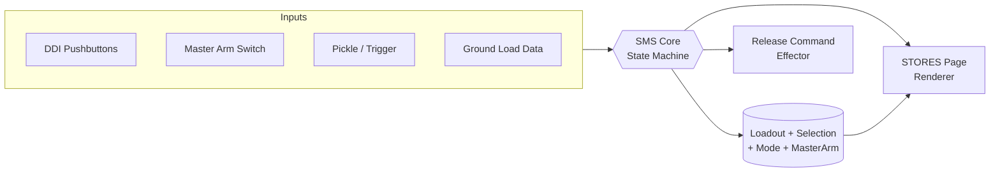
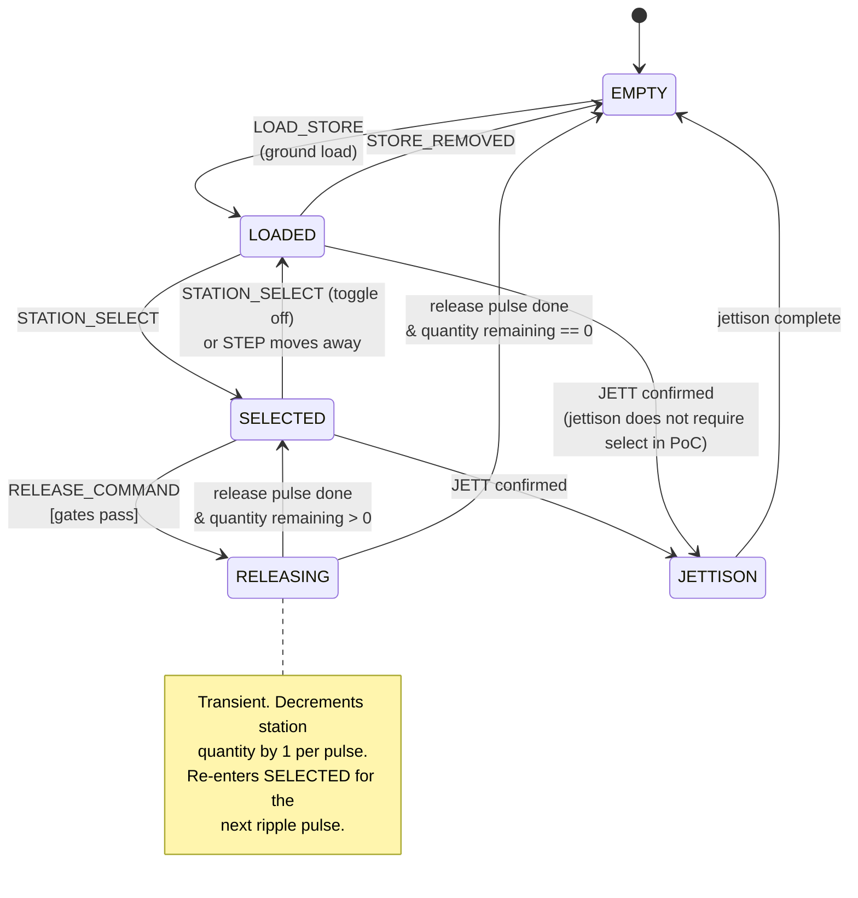
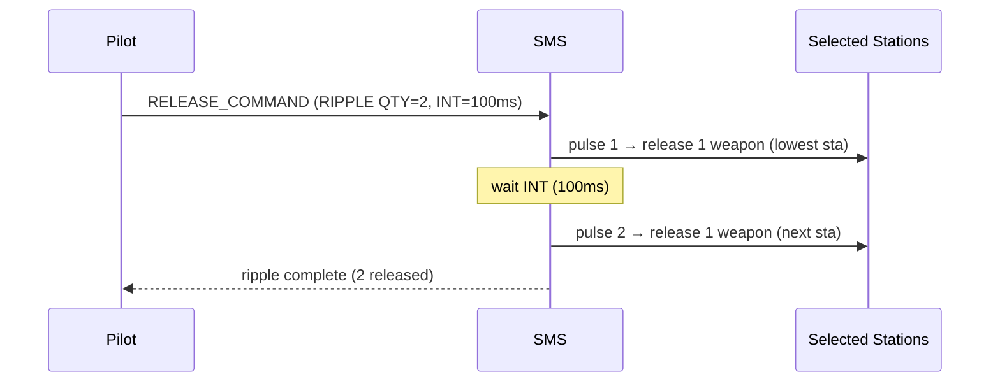
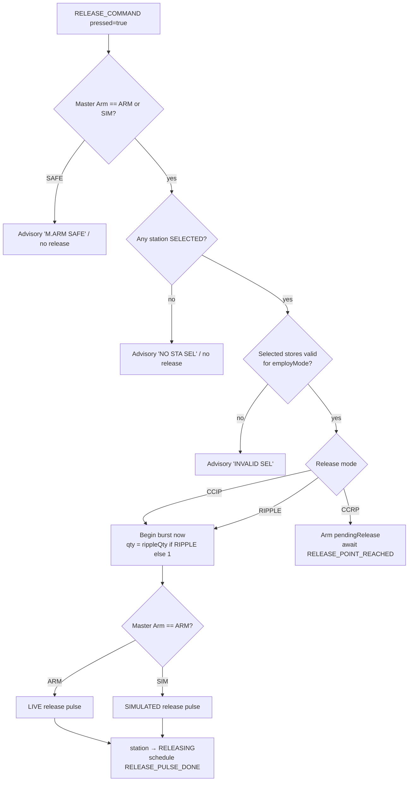
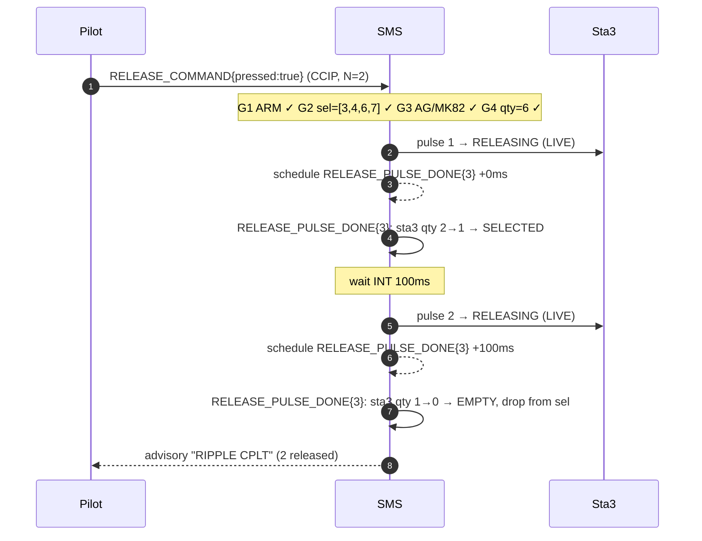

# F/A-18C Hornet — Stores Management System (SMS) Stores Page

**Technical Specification — Proof of Concept**

| Field | Value |
|-------|-------|
| Document | SMS Stores Page — Implementation Specification |
| Status | Draft for implementation |
| Scope | Single DDI "STORES" format: equip, select, manage, and release weapons |
| Audience | Implementing engineer (no prior avionics context assumed) |
| Fidelity | Functional proof-of-concept. Not flight-rated, not a training device. |

> **Reading note for the implementer.** This document is self-contained. Every
> term is defined on first use. Where the real aircraft has behavior we are
> *not* modeling, it is called out explicitly in [§12 Out of Scope](#12-out-of-scope).
> Treat the [data model](#8-data-model--schema), [event model](#9-input-event-model),
> and [state machine](#5-station-state-machine) as the normative contract; prose
> and diagrams are explanatory.

---

## Table of Contents

1. [Purpose & Glossary](#1-purpose--glossary)
2. [System Overview](#2-system-overview)
3. [Hardware/UI Model: The DDI](#3-hardwareui-model-the-ddi)
4. [Stores Page Layout](#4-stores-page-layout)
5. [Station State Machine](#5-station-state-machine)
6. [Weapon Types](#6-weapon-types)
7. [Release Modes & Master Arm](#7-release-modes--master-arm)
8. [Data Model / Schema](#8-data-model--schema)
9. [Input Event Model](#9-input-event-model)
10. [Release Logic & Gating](#10-release-logic--gating)
11. [Worked Example Walkthrough](#11-worked-example-walkthrough)
12. [Out of Scope](#12-out-of-scope)
13. [Appendix A — Ada Type Sketch](#appendix-a--ada-type-sketch)
14. [Appendix B — Mnemonics & Defaults Reference](#appendix-b--mnemonics--defaults-reference)

---

## 1. Purpose & Glossary

The **Stores Management System (SMS)** is the avionics subsystem that tracks
what weapons and stores are physically hung on the aircraft, lets the pilot
**select** which ones to employ, sets **how** they will be released, and
**commands** their release when the pilot pulls the trigger or presses the
pickle (bomb release) button. This spec covers the cockpit **Stores page** — the
DDI format the pilot interacts with to do all of the above.

| Term | Definition |
|------|------------|
| **DDI** | Digital Display Indicator. A square cockpit screen framed by 20 physical pushbuttons. The Hornet has multiple DDIs; the STORES format can be called up on any of them. |
| **Format / Page** | A full-screen mode displayed on a DDI. This spec defines the **STORES** format. |
| **Pushbutton (PB)** | One of the 20 physical buttons around a DDI's bezel, numbered PB1–PB20. Their function depends on the active format; the on-screen label adjacent to a button (the *legend*) tells the pilot what it does right now. |
| **Station** | A physical hardpoint on the airframe where a store can be hung. The Hornet has stations 1–9 (see [§4](#4-stores-page-layout)). |
| **Store** | Anything carried on a station: a weapon, a fuel tank, a pod, or a rack. |
| **Rack** | A mechanical adapter (e.g. a TER — Triple Ejector Rack) allowing multiple weapons on one station. Modeled abstractly here as a per-station *capacity*. |
| **Selected station** | The station(s) the SMS will release from on the next release command. |
| **Master Arm** | A cockpit switch (SAFE / ARM) with an added SIM software state, that globally gates whether live release is possible. The single most important safety interlock. |
| **Pickle** | The bomb-release pushbutton on the control stick (air-to-ground). |
| **Release mode** | How weapons come off: CCIP, CCRP, or RIPPLE. Defined in [§7](#7-release-modes--master-arm). |
| **Fuze** | The arming device on a bomb that determines when/if it detonates (NOSE, TAIL, NOSE/TAIL, or SAFE). |
| **Jettison** | Emergency or selective discarding of stores, typically *unarmed*, to shed weight or hung ordnance. |

---

## 2. System Overview

The SMS proof-of-concept is a state machine driven by discrete input events. It
holds:

- One **loadout** — the immutable-at-runtime inventory of what is hung where
  (set at "load" time, e.g. on the ground).
- Mutable **selection & mode state** — which stations are selected, the active
  release mode and its parameters, and the Master Arm state.
- Per-station **runtime state** — see the [station state machine](#5-station-state-machine).



**Single source of truth.** All UI rendering is a pure function of the model
(`render(model) -> screen`). All state change happens by applying an event to
the model (`apply(model, event) -> model'`). The renderer never mutates state.

---

## 3. Hardware/UI Model: The DDI

The STORES format renders inside a square display surrounded by **20
pushbuttons**, arranged **5 per side** (top, bottom, left, right). This is the
"5×5"-style bezel the brief refers to: a 5-wide top/bottom row and a 5-tall
left/right column framing the central display.

```
            PB1   PB2   PB3   PB4   PB5
          ┌─────────────────────────────────┐
    PB20 ─┤                                  ├─ PB6
    PB19 ─┤                                  ├─ PB7
    PB18 ─┤        CENTRAL DISPLAY           ├─ PB8
    PB17 ─┤        (station blocks,          ├─ PB9
    PB16 ─┤         status, advisories)      ├─ PB10
          └─────────────────────────────────┘
           PB15  PB14  PB13  PB12  PB11
```

Numbering convention used throughout this spec:

- **Top row, left→right:** PB1, PB2, PB3, PB4, PB5
- **Right column, top→bottom:** PB6, PB7, PB8, PB9, PB10
- **Bottom row, right→left:** PB11, PB12, PB13, PB14, PB15
- **Left column, bottom→top:** PB16, PB17, PB18, PB19, PB20

Each pushbutton has an adjacent on-screen **legend** (0–8 chars). A button with
no legend is **inert** (press is ignored). Legends may be **boxed** to indicate
the function is currently active/selected.

---

## 4. Stores Page Layout

### 4.1 Stations

The F/A-18C has nine stations, numbered left wingtip to right wingtip as seen
from above (pilot's perspective, nose up):

```
        (1)                                   (9)
         │                                     │
     ┌───┴───┐                             ┌───┴───┐
    (2)     (3)        (4) (5) (6)        (7)     (8)
  outbd    inbd      fuse cl fuse        inbd    outbd
   wing    wing      cheek   cheek        wing    wing
```

| Station | Location | Typical store class | Notes |
|--------:|----------|---------------------|-------|
| 1 | Left wingtip | AIM-9 only | Wingtip rail; air-to-air short range only. |
| 2 | Left outboard wing pylon | A/G bombs, AIM-9 | |
| 3 | Left inboard wing pylon | A/G bombs (rack-capable), fuel tank | High capacity; common bomb station. |
| 4 | Left fuselage cheek | AIM-7, fuel tank (centerline-class), pod | |
| 5 | Centerline | Fuel tank, A/G bombs | |
| 6 | Right fuselage cheek | AIM-7, pod | |
| 7 | Right inboard wing pylon | A/G bombs (rack-capable), fuel tank | High capacity; common bomb station. |
| 8 | Right outboard wing pylon | A/G bombs, AIM-9 | |
| 9 | Right wingtip | AIM-9 only | Wingtip rail; air-to-air short range only. |

> The compatibility column above is **advisory** for this PoC (used to validate
> loadouts at load time). The runtime release logic does not re-check
> compatibility.

### 4.2 Central display contents

The central area is laid out to mirror the airframe planform so the pilot reads
stations spatially. Each **station block** shows:

```
 ┌──────────┐
 │ 3        │   ← station number
 │ MK82     │   ← weapon mnemonic (or blank if EMPTY)
 │ x2       │   ← quantity remaining on this station
 │ [SEL]    │   ← selection / state indicator (see §5.3)
 └──────────┘
```

A central **status strip** shows the global mode line:

```
   MASTER ARM: SAFE        MODE: CCIP        QTY 2  INT 100
```

### 4.3 Pushbutton legend map (STORES format)

| PB | Legend | Function |
|----|--------|----------|
| PB1 | `STA1` | Select / deselect station 1 |
| PB2 | `STA2` | Select / deselect station 2 |
| PB3 | `STA3` | Select / deselect station 3 |
| PB4 | `STA4` | Select / deselect station 4 |
| PB5 | `STA5` | Select / deselect station 5 |
| PB6 | `STA6` | Select / deselect station 6 |
| PB7 | `STA7` | Select / deselect station 7 |
| PB8 | `STA8` | Select / deselect station 8 |
| PB9 | `STA9` | Select / deselect station 9 |
| PB10 | `MODE` | Cycle release mode: CCIP → CCRP → RIPPLE → CCIP |
| PB11 | `QTY` | Increment ripple quantity (wraps at max) |
| PB12 | `INT` | Increment ripple interval (wraps at max) |
| PB13 | `FUZE` | Cycle fuze of selected stations: NOSE → TAIL → N/T → SAFE |
| PB14 | `MARM` | Cycle Master Arm: SAFE → ARM → SIM → SAFE |
| PB15 | `JETT` | Arm/confirm selective jettison of selected stations |
| PB16 | `STEP` | Step selection to next available like-type station |
| PB17 | — | (inert in PoC) |
| PB18 | — | (inert in PoC) |
| PB19 | — | (inert in PoC) |
| PB20 | `A/G` `A/A` | Toggle master employment mode (air-to-ground / air-to-air) |

> The physical **Master Arm switch** and **pickle/trigger** are *not*
> pushbuttons; they enter the system as the events `MASTER_ARM_SET` and
> `RELEASE_COMMAND` (see [§9](#9-input-event-model)). PB14 `MARM` is a
> soft mirror provided for the PoC so the whole flow is exercisable from one
> screen.

---

## 5. Station State Machine

Every station is always in exactly one of five states.

| State | Meaning |
|-------|---------|
| `EMPTY` | No store hung, or station's stores are expended. |
| `LOADED` | Store present, not selected for employment. |
| `SELECTED` | Store present and selected; will be acted on by the next release command. |
| `RELEASING` | A release sequence is in progress for this station (transient). |
| `JETTISON` | Selective jettison armed/executing for this station (transient). |

### 5.1 Diagram



### 5.2 Transition table

| # | From | Event | Guard | To | Side effect |
|---|------|-------|-------|----|-------------|
| T1 | EMPTY | `LOAD_STORE` | valid store for station | LOADED | set store, qty, fuze defaults |
| T2 | LOADED | `STORE_REMOVED` | — | EMPTY | clear store |
| T3 | LOADED | `STATION_SELECT` | store is selectable in current A/A–A/G mode | SELECTED | add to selection set |
| T4 | SELECTED | `STATION_SELECT` | — | LOADED | remove from selection set |
| T5 | SELECTED | `RELEASE_COMMAND` | all release gates pass (§10) | RELEASING | begin pulse |
| T6 | RELEASING | *(internal: pulse complete)* | qty\_remaining > 0 | SELECTED | qty -= 1 |
| T7 | RELEASING | *(internal: pulse complete)* | qty\_remaining == 0 | EMPTY | qty = 0; drop from selection |
| T8 | SELECTED / LOADED | `JETTISON_CONFIRM` | jettison armed | JETTISON | begin jettison |
| T9 | JETTISON | *(internal: complete)* | — | EMPTY | qty = 0; clear store |

> **Concurrency note.** In RIPPLE the SMS walks the selected stations and
> releases one weapon per pulse, returning each station to SELECTED until its
> quantity hits zero. The PoC processes pulses on a fixed cadence (the ripple
> **interval**); see [§7.3](#73-ripple).

### 5.3 State → station-block indicator

| State | Indicator text | Style |
|-------|----------------|-------|
| EMPTY | *(blank)* | dim |
| LOADED | `RDY` | normal |
| SELECTED | `SEL` | **boxed** |
| RELEASING | `REL` | flashing |
| JETTISON | `JETT` | flashing, caution color |

---

## 6. Weapon Types

Four store types are modeled. All quantities/limits below are PoC values, not
real-world figures.

| Mnemonic | Name | Class | Default qty/station | Max qty/station | Fuze applicable | Release modes | Notes |
|----------|------|-------|--------------------:|----------------:|:---------------:|---------------|-------|
| `MK82` | Mk-82 | Unguided GP bomb (A/G) | 1 | 3 (TER) | Yes | CCIP, CCRP, RIPPLE | The only ripple-capable store in this PoC. |
| `AIM9` | AIM-9 Sidewinder | IR short-range AAM (A/A) | 1 | 1 | No | n/a (trigger employ) | Wingtip/outboard only. Not part of A/G release flow. |
| `AIM7` | AIM-7 Sparrow | SARH medium-range AAM (A/A) | 1 | 1 | No | n/a (trigger employ) | Fuselage stations. |
| `TANK` | External fuel tank | Non-weapon store | 1 | 1 | No | n/a | Selectable only for **jettison**, never for release. |

### 6.1 Per-type behavioral rules

- **MK82** — Air-to-ground. Participates fully in CCIP/CCRP/RIPPLE. Fuze must be
  set; releasing with fuze `SAFE` is allowed (inert/practice drop) and is *not*
  blocked, but raises advisory `FUZE SAFE`.
- **AIM9 / AIM7** — Air-to-air. In this PoC their employment is abstracted: when
  in A/A mode, selecting an AAM station and issuing `RELEASE_COMMAND` fires one
  missile from the highest-priority selected AAM station (decrement qty by 1).
  No CCIP/CCRP/RIPPLE applies. Release gates (Master Arm) still apply.
- **TANK** — Never selectable for release. May only transition to `JETTISON`.
  Attempting `STATION_SELECT` for release on a TANK in A/G mode is rejected with
  advisory `INVALID SEL`.

---

## 7. Release Modes & Master Arm

### 7.1 CCIP — Continuously Computed Impact Point

The system continuously computes where a bomb would hit *right now* and draws a
pipper at that point. The pilot flies the pipper onto the target and presses
**pickle** to release. Conceptually: *"release happens at the instant the pilot
commands it."*

- One `RELEASE_COMMAND` → one pulse (or a ripple burst if RIPPLE qty/interval
  set, see §7.3).
- PoC has no ballistics; CCIP simply means *release-on-command, immediate*.

### 7.2 CCRP — Continuously Computed Release Point

The pilot designates a target; the system computes the *future* release point
and releases automatically when the aircraft reaches it. The pilot presses and
**holds** pickle as consent; the system releases when its computed condition is
met.

- PoC model: `RELEASE_COMMAND` arms a **pending release**. A subsequent internal
  `RELEASE_POINT_REACHED` trigger (simulated/manual in PoC) executes the pulse.
- Releasing `RELEASE_COMMAND` *up* (pickle released) before the point is reached
  cancels the pending release.

### 7.3 RIPPLE

Releases a **string** of weapons in sequence rather than one at a time, governed
by two parameters:

| Parameter | Legend | Meaning | Range (PoC) | Step | Default |
|-----------|--------|---------|-------------|------|---------|
| Quantity | `QTY` | Number of weapons released per release command | 1–6 | +1 (wraps) | 1 |
| Interval | `INT` | Time between pulses, milliseconds | 50–500 | +50 (wraps) | 100 |

- RIPPLE with `QTY 1` is equivalent to single release.
- The ripple **draws down** from selected stations in selection-priority order
  (lowest station number first), one weapon per pulse, until `QTY` weapons have
  been released or selected stations are exhausted (whichever first).
- Interval pacing is honored between pulses; in CCIP the burst begins
  immediately, in CCRP it begins at the release point.



### 7.4 Master Arm

Master Arm is the global release interlock. Three states:

| State | Legend | Live release? | Effect |
|-------|--------|:-------------:|--------|
| `SAFE` | `SAFE` | **No** | All release commands ignored (advisory `M.ARM SAFE`). Selection and mode changes still allowed. This is the power-on default. |
| `ARM` | `ARM` (boxed, caution) | **Yes** | Release commands execute and physically release stores. |
| `SIM` | `SIM` | No (simulated) | Release commands run the *entire* state machine — RELEASING transitions, quantity decrements, advisories — but emit a **simulated** release effect instead of a live one. Used for training/checkout. |

> **Default-deny.** Any state other than `ARM` blocks live release. `SIM` is not
> a partial-arm: it never produces a live effect. The renderer must make the
> armed condition unmistakable (boxed, caution-colored `ARM`).

---

## 8. Data Model / Schema

The model is split into **Loadout** (set at load time) and **SMS runtime state**
(mutated by events). Below is the authoritative JSON Schema, followed by a
sample instance.

### 8.1 JSON Schema

```json
{
  "$schema": "https://json-schema.org/draft/2020-12/schema",
  "$id": "https://example.org/fa18/sms-state.schema.json",
  "title": "SMS State",
  "type": "object",
  "required": ["loadout", "selection", "mode", "masterArm", "employMode", "stationStates"],
  "properties": {
    "loadout": {
      "type": "object",
      "required": ["stations"],
      "properties": {
        "stations": {
          "type": "array",
          "minItems": 9,
          "maxItems": 9,
          "items": { "$ref": "#/$defs/station" }
        }
      }
    },
    "selection": {
      "description": "Station numbers currently selected, in selection-priority order (ascending).",
      "type": "array",
      "items": { "type": "integer", "minimum": 1, "maximum": 9 },
      "uniqueItems": true
    },
    "mode": {
      "type": "object",
      "required": ["release", "rippleQty", "rippleIntervalMs"],
      "properties": {
        "release":          { "enum": ["CCIP", "CCRP", "RIPPLE"] },
        "rippleQty":        { "type": "integer", "minimum": 1, "maximum": 6 },
        "rippleIntervalMs": { "type": "integer", "minimum": 50, "maximum": 500, "multipleOf": 50 }
      }
    },
    "masterArm":  { "enum": ["SAFE", "ARM", "SIM"] },
    "employMode": { "enum": ["AG", "AA"] },
    "stationStates": {
      "description": "Runtime state per station, index 0 == station 1.",
      "type": "array",
      "minItems": 9,
      "maxItems": 9,
      "items": { "enum": ["EMPTY", "LOADED", "SELECTED", "RELEASING", "JETTISON"] }
    },
    "pendingRelease": {
      "description": "Set when CCRP release is armed and awaiting RELEASE_POINT_REACHED.",
      "type": ["object", "null"],
      "properties": {
        "remainingQty": { "type": "integer", "minimum": 0 }
      }
    },
    "advisories": {
      "type": "array",
      "items": { "type": "string" }
    }
  },
  "$defs": {
    "station": {
      "type": "object",
      "required": ["station", "store"],
      "properties": {
        "station": { "type": "integer", "minimum": 1, "maximum": 9 },
        "store": {
          "type": ["object", "null"],
          "description": "null == physically empty hardpoint",
          "required": ["type", "quantity"],
          "properties": {
            "type":     { "enum": ["MK82", "AIM9", "AIM7", "TANK"] },
            "quantity": { "type": "integer", "minimum": 0, "maximum": 3 },
            "fuze":     { "enum": ["NOSE", "TAIL", "NOSE_TAIL", "SAFE", "NA"], "default": "NA" }
          }
        }
      }
    }
  }
}
```

### 8.2 Field notes

- `loadout.stations` is **fixed at load time**. Runtime release/jettison
  decrements `store.quantity` and may set `store` to `null` when expended; the
  array itself stays length-9.
- `fuze` is `NA` for any non-bomb store. For `MK82` it defaults to `NOSE_TAIL`
  at load and is cycled by the `FUZE` button.
- `selection` and `stationStates` are redundant by design (selection set vs.
  per-station enum) so the renderer can index either way; `apply()` must keep
  them consistent.
- `advisories` is a render-only list of short caution/advisory strings rebuilt
  each `apply()`.

### 8.3 Sample instance (pre-flight, nothing selected)

```json
{
  "loadout": {
    "stations": [
      { "station": 1, "store": { "type": "AIM9", "quantity": 1, "fuze": "NA" } },
      { "station": 2, "store": null },
      { "station": 3, "store": { "type": "MK82", "quantity": 2, "fuze": "NOSE_TAIL" } },
      { "station": 4, "store": { "type": "MK82", "quantity": 1, "fuze": "NOSE_TAIL" } },
      { "station": 5, "store": { "type": "TANK", "quantity": 1, "fuze": "NA" } },
      { "station": 6, "store": { "type": "MK82", "quantity": 1, "fuze": "NOSE_TAIL" } },
      { "station": 7, "store": { "type": "MK82", "quantity": 2, "fuze": "NOSE_TAIL" } },
      { "station": 8, "store": null },
      { "station": 9, "store": { "type": "AIM9", "quantity": 1, "fuze": "NA" } }
    ]
  },
  "selection": [],
  "mode": { "release": "CCIP", "rippleQty": 1, "rippleIntervalMs": 100 },
  "masterArm": "SAFE",
  "employMode": "AG",
  "stationStates": ["LOADED","EMPTY","LOADED","LOADED","LOADED","LOADED","LOADED","EMPTY","LOADED"],
  "pendingRelease": null,
  "advisories": ["M.ARM SAFE"]
}
```

This sample is the exact starting state for the [worked example](#11-worked-example-walkthrough):
6× Mk82 across stations 3, 4, 6, 7 (2+1+1+2).

---

## 9. Input Event Model

All state change flows through a single reducer:

```
apply(state, event) -> state'
```

Events are tagged unions. `source` is informational (which physical control
originated it).

### 9.1 Event catalog

| Event | Payload | Origin | Effect summary |
|-------|---------|--------|----------------|
| `LOAD_STORE` | `{station, type, quantity, fuze?}` | Ground load | EMPTY → LOADED (T1). Rejected if station occupied or invalid combo. |
| `STORE_REMOVED` | `{station}` | Ground | → EMPTY (T2). |
| `STATION_SELECT` | `{station}` | PB1–PB9 | Toggle station in/out of selection (T3/T4). Validates selectability. |
| `STEP` | `{}` | PB16 | Move selection to next like-type station (deselect current, select next). |
| `MODE_CYCLE` | `{}` | PB10 | CCIP→CCRP→RIPPLE→CCIP. |
| `RIPPLE_QTY_INC` | `{}` | PB11 | rippleQty +1, wrap 6→1. |
| `RIPPLE_INT_INC` | `{}` | PB12 | rippleIntervalMs +50, wrap 500→50. |
| `FUZE_CYCLE` | `{}` | PB13 | Cycle fuze on all selected bomb stations: NOSE→TAIL→NOSE_TAIL→SAFE→NOSE. |
| `MASTER_ARM_SET` | `{value: SAFE\|ARM\|SIM}` | Master Arm switch / PB14 | Set Master Arm state. |
| `EMPLOY_MODE_TOGGLE` | `{}` | PB20 | AG↔AA. Clears selection on change. |
| `JETTISON_ARM` | `{}` | PB15 (1st press) | Arms jettison; sets advisory `JETT ARMED`. |
| `JETTISON_CONFIRM` | `{}` | PB15 (2nd press, armed) | Selected stations → JETTISON → EMPTY (T8/T9). |
| `RELEASE_COMMAND` | `{pressed: bool}` | Pickle / trigger | `pressed:true` requests release; in CCRP `pressed:false` cancels pending. |
| `RELEASE_POINT_REACHED` | `{}` | Nav (sim/manual in PoC) | Executes CCRP pending release. |
| `RELEASE_PULSE_DONE` | `{station}` | Internal timer | Completes a RELEASING pulse (T6/T7); advances ripple. |

### 9.2 Event ordering & invariants

1. Events are processed **one at a time, in arrival order** (single-threaded
   reducer). The ripple timer enqueues `RELEASE_PULSE_DONE` events; it does not
   mutate state directly.
2. `apply()` is **total**: an invalid event (e.g. selecting an empty station)
   does not throw — it returns state unchanged plus an advisory.
3. After every `apply()`, the following invariants hold:
   - `stationStates[i] == SELECTED`  ⇔  `(i+1) ∈ selection`.
   - A station in `SELECTED`/`RELEASING` has a non-null store with `quantity > 0`.
   - `masterArm != ARM`  ⇒  no station is in `RELEASING` due to a *live* effect.

### 9.3 Pseudocode skeleton

```python
def apply(state, event):
    s = deepcopy(state)
    s.advisories = []
    match event.type:
        case "STATION_SELECT":
            st = s.loadout.stations[event.station - 1]
            if st.store is None:
                s.advisories.append("EMPTY STA"); return s
            if not selectable(st.store, s.employMode):
                s.advisories.append("INVALID SEL"); return s
            toggle_selection(s, event.station)
        case "MODE_CYCLE":
            s.mode.release = next_mode(s.mode.release)
        case "MASTER_ARM_SET":
            s.masterArm = event.value
        case "RELEASE_COMMAND":
            return handle_release(s, event)   # see §10
        case "RELEASE_PULSE_DONE":
            return advance_ripple(s, event.station)
        # ... remaining events ...
    rebuild_advisories(s)
    return s
```

---

## 10. Release Logic & Gating

`RELEASE_COMMAND{pressed:true}` is the heart of the system. It must pass **all**
gates before any station leaves `SELECTED`.

### 10.1 Release gate sequence



### 10.2 Gate definitions (evaluated in order)

| # | Gate | Pass condition | On fail |
|---|------|----------------|---------|
| G1 | **Master Arm** | `masterArm ∈ {ARM, SIM}` | advisory `M.ARM SAFE`, abort |
| G2 | **Selection non-empty** | `len(selection) > 0` | advisory `NO STA SEL`, abort |
| G3 | **Mode/store compatibility** | selected stores valid for `employMode` and (A/G) at least one releasable bomb | advisory `INVALID SEL`, abort |
| G4 | **Quantity available** | selected stations have total `quantity > 0` | advisory `NO STORES`, abort |

If all gates pass:

- **CCIP / RIPPLE:** begin burst immediately. Burst size `N = (mode==RIPPLE) ? rippleQty : 1`.
- **CCRP:** set `pendingRelease = {remainingQty: N}`; do not pulse yet.
  `RELEASE_POINT_REACHED` (or holding consent satisfied) starts the burst;
  `RELEASE_COMMAND{pressed:false}` before then clears `pendingRelease`
  (advisory `RIPPLE CANCEL` / `CCRP CANCEL`).

### 10.3 Burst execution (CCIP & CCRP, once started)

1. Build the **draw-down order**: selected stations ascending, repeated by their
   remaining quantity, e.g. `[3,3,4,6,7,7]` for the worked example.
2. For pulse `k = 1..N` (N capped by available stores):
   - Take next station `s` from draw-down order.
   - `stationStates[s] = RELEASING`; emit effect (LIVE if `ARM`, SIM if `SIM`).
   - Schedule `RELEASE_PULSE_DONE{station:s}` after `rippleIntervalMs`
     (interval is `0` effectively for the first pulse).
3. On each `RELEASE_PULSE_DONE{station:s}` (`advance_ripple`):
   - Decrement that station's `store.quantity` by 1.
   - If `quantity == 0`: `store = null`, `stationStates[s] = EMPTY`, drop from
     selection (T7). Else `stationStates[s] = SELECTED` (T6).
   - If pulses remain, proceed to next pulse; else burst complete
     (advisory `RIPPLE CPLT` for multi, none for single).

### 10.4 Air-to-air release (AIM-9 / AIM-7)

In `employMode == AA`, `RELEASE_COMMAND` ignores release mode/ripple. With gates
G1–G2 passing, fire **one** missile from the lowest-numbered selected AAM
station: decrement qty, station → EMPTY, advisory `FOX-2` (AIM-9) or `FOX-1`
(AIM-7). No interval/burst.

---

## 11. Worked Example Walkthrough

**Goal:** Pilot loads 6× Mk82 across stations 3/4/6/7, selects RIPPLE 2, enters
CCIP, arms, and commits a release.

Starting state = the [sample instance in §8.3](#83-sample-instance-pre-flight-nothing-selected)
(loadout already hung on the ground: sta3 ×2, sta4 ×1, sta6 ×1, sta7 ×2 = 6×
MK82; sta1/9 AIM-9; sta5 TANK). `employMode = AG`, `masterArm = SAFE`,
`mode = CCIP`, nothing selected.

| Step | Pilot action | Event | Resulting state change | STORES page shows |
|-----:|--------------|-------|------------------------|-------------------|
| 1 | Confirm A/G mode | *(already AG)* | — | status: `MODE: CCIP` |
| 2 | Press `STA3` (PB3) | `STATION_SELECT{3}` | sta3 LOADED→SELECTED; `selection=[3]` | sta3 block `SEL` boxed |
| 3 | Press `STA4` (PB4) | `STATION_SELECT{4}` | sta4 SELECTED; `selection=[3,4]` | sta4 `SEL` |
| 4 | Press `STA6` (PB6) | `STATION_SELECT{6}` | sta6 SELECTED; `selection=[3,4,6]` | sta6 `SEL` |
| 5 | Press `STA7` (PB7) | `STATION_SELECT{7}` | sta7 SELECTED; `selection=[3,4,6,7]` | sta7 `SEL` |
| 6 | Press `MODE` (PB10) ×2 | `MODE_CYCLE` ×2 | CCIP→CCRP→**RIPPLE** | `MODE: RIPPLE` |
| 7 | Press `QTY` (PB11) | `RIPPLE_QTY_INC` | rippleQty 1→**2** | `QTY 2` |
| 8 | (interval default OK) | — | rippleIntervalMs = 100 | `INT 100` |
| 9 | Press `MODE` (PB10) | `MODE_CYCLE` | RIPPLE→CCIP→… **back to CCIP** | `MODE: CCIP` |
| 10 | Master Arm → ARM | `MASTER_ARM_SET{ARM}` | masterArm = ARM | `MASTER ARM: ARM` boxed/caution |
| 11 | Press & hold **pickle** | `RELEASE_COMMAND{true}` | Gates G1–G4 pass; CCIP burst N=2 begins | sta3 → `REL` flashing |

> **Step 6/9 note on intent.** The brief says "selects RIPPLE 2 … enters CCIP."
> In the real jet, CCIP is the *delivery* mode and RIPPLE *quantity* is an
> orthogonal multiple-release setting that applies within CCIP. This PoC models
> them as one cycling field for simplicity, so to honor the intent we set
> `rippleQty = 2` (the "RIPPLE 2" string size) and leave the delivery mode on
> **CCIP**. Implementers preferring orthogonal settings should split `release`
> (CCIP/CCRP) from a separate `stringQty` — see [§12](#12-out-of-scope).
> Either way, the committed release below drops **2** Mk82 in CCIP.

### 11.1 Release sequence detail (Step 11 onward)

Draw-down order from `selection=[3,4,6,7]` with quantities `[2,1,1,2]` is
`[3,3,4,6,7,7]`. Burst size `N = stringQty = 2`, interval `100 ms`.



**State after the 2-weapon CCIP release:**

| Station | Before | After | State |
|--------:|:------:|:-----:|-------|
| 3 (MK82) | ×2 | ×0 | EMPTY (dropped from selection) |
| 4 (MK82) | ×1 | ×1 | SELECTED |
| 6 (MK82) | ×1 | ×1 | SELECTED |
| 7 (MK82) | ×2 | ×2 | SELECTED |

`selection` is now `[4,6,7]`, 4 Mk82 remain. Releasing pickle
(`RELEASE_COMMAND{false}`) in CCIP simply ends the command; the next press drops
the next 2. Setting Master Arm back to `SAFE` re-inhibits release.

> If the pilot had instead set Master Arm to **SIM** at step 10, every state
> transition above is identical but each pulse emits a *simulated* release — no
> weapon physically separates — which is exactly how a checkout/training run is
> exercised.

---

## 12. Out of Scope

The following are **explicitly excluded** from this proof-of-concept. An
implementer should **not** build these, and may stub or hardcode where noted.

| Area | Out of scope — do **not** implement |
|------|-------------------------------------|
| **Ballistics & nav** | Real CCIP/CCRP impact-point computation, wind, drag, target designation, INS/GPS, release cues, pipper geometry. CCIP = release-on-command; CCRP point arrival is a manual/sim trigger. |
| **Sensors & targeting** | Radar (for AIM-7 illumination), IR seeker lock (AIM-9), FLIR/targeting pod, TGT designation, sensor slewing. A/A employment is abstracted to "fire one." |
| **Full weapon catalog** | Any store beyond MK82, AIM9, AIM7, TANK (no AIM-120, JDAM, Maverick, HARM, rockets, gun/cannon, laser-guided, cluster, etc.). |
| **Real loadout limits** | True per-station carriage limits, asymmetry/weight-and-balance checks, MER/TER mechanics, rack step logic beyond simple capacity. Use the PoC max quantities in §6. |
| **Selective jettison fidelity** | Emergency jettison switch, fuel-tank transfer state, stores-config drag index, jettison envelopes. Jettison here just empties selected stations unarmed. |
| **Hardware integration** | Real 1553 bus, store-station electrical interlocks, weight-on-wheels inhibit, landing-gear/flap inhibit, hung-store detection, BIT (built-in test). |
| **Multi-display & HUD** | HUD symbology, other DDI formats (HSI, RADAR, FLIR, FCS, checklists), UFC integration, display decluttering, brightness/day-night. Only the STORES format is in scope. |
| **Authorization / safety case** | This is **not** flight-rated software. No DO-178C/airworthiness artifacts, no real arming of live ordnance. The "LIVE" effect is a logged event, not a hardware command. |
| **Persistence & networking** | Saving loadouts to disk, mission planning import, datalink, multiplayer/sim integration. |
| **Orthogonal mode/qty split (optional)** | The real jet treats delivery mode (CCIP/CCRP) and string/ripple quantity as independent. The PoC may keep them merged (§11). Splitting them is a *permitted enhancement*, not a requirement. |

---

## Appendix A — Ada Type Sketch

The repository's `.gitignore` targets Ada build artifacts (`*.o`, `*.ali`),
suggesting an Ada implementation — a natural fit for avionics. The model above
maps cleanly to strongly-typed Ada. This sketch is **illustrative**, not
normative; the JSON Schema in §8 is the authoritative contract.

```ada
package SMS is

   type Station_Id  is range 1 .. 9;
   type Store_Type  is (MK82, AIM9, AIM7, TANK);
   type Fuze_Type   is (Nose, Tail, Nose_Tail, Safe, NA);
   type Station_State is (Empty, Loaded, Selected, Releasing, Jettison);
   type Release_Mode  is (CCIP, CCRP, Ripple);
   type Master_Arm    is (Safe, Arm, Sim);
   type Employ_Mode   is (AG, AA);

   subtype Quantity      is Natural range 0 .. 3;
   subtype Ripple_Qty    is Positive range 1 .. 6;
   subtype Interval_Ms   is Positive range 50 .. 500;  -- step 50

   type Store is record
      Kind     : Store_Type;
      Quantity : SMS.Quantity := 0;
      Fuze     : Fuze_Type    := NA;
   end record;

   type Station_Record is record
      Present : Boolean        := False;  -- False => empty hardpoint
      Item    : Store;
      State   : Station_State  := Empty;
   end record;

   type Loadout is array (Station_Id) of Station_Record;

   type SMS_State is record
      Stations    : Loadout;
      Mode        : Release_Mode := CCIP;
      Rpl_Qty     : Ripple_Qty   := 1;
      Rpl_Int     : Interval_Ms  := 100;
      Arm         : Master_Arm   := Safe;
      Employ      : Employ_Mode  := AG;
   end record;

   --  Total reducer: never raises on bad input; returns updated state.
   procedure Apply (State : in out SMS_State; Event : Input_Event);

end SMS;
```

---

## Appendix B — Mnemonics & Defaults Reference

**Advisory strings** (short, render-only):

| String | Raised when |
|--------|-------------|
| `M.ARM SAFE` | Release attempted with Master Arm SAFE. |
| `NO STA SEL` | Release attempted with empty selection. |
| `INVALID SEL` | Selected store not valid for current employ mode (e.g. TANK for release). |
| `NO STORES` | Selected stations have zero remaining quantity. |
| `EMPTY STA` | Selecting an empty hardpoint. |
| `FUZE SAFE` | Release with bomb fuze set SAFE (inert drop) — informational, not blocking. |
| `JETT ARMED` | First `JETT` press; awaiting confirm. |
| `RIPPLE CPLT` | Multi-weapon burst finished. |
| `CCRP CANCEL` | Pending CCRP release cancelled before release point. |
| `FOX-1` / `FOX-2` | AIM-7 / AIM-9 simulated launch. |

**Defaults at power-on / load:**

| Field | Default |
|-------|---------|
| `masterArm` | `SAFE` |
| `employMode` | `AG` |
| `mode.release` | `CCIP` |
| `mode.rippleQty` | `1` |
| `mode.rippleIntervalMs` | `100` |
| MK82 fuze (at load) | `NOSE_TAIL` |
| selection | empty |

---

*End of specification.*
